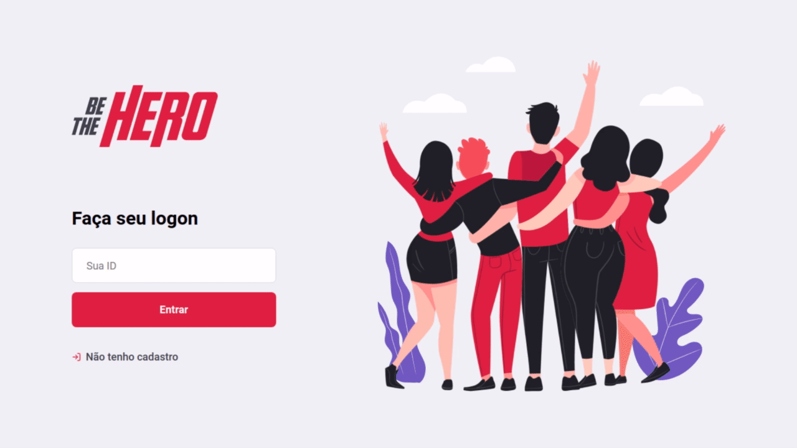
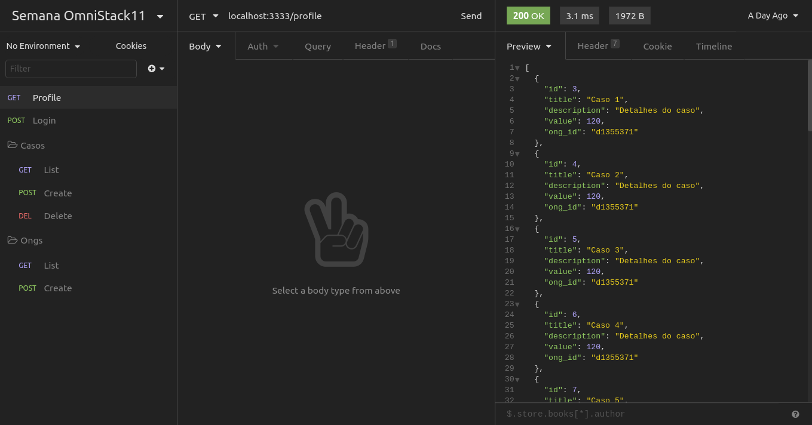

</img>
<h1 align="center">Semana Omnistack 11</h1>
<p align="center">Projeto <strong>Be The Hero</strong> desenvolvido durante a Omnistack da Rocketseat</p>

<p align="center">
  <a aria-label="Versão do Node" href="https://github.com/nodejs/node/blob/master/doc/changelogs/CHANGELOG_V12.md#12.16.1">
    </img>
  </a>
  <a aria-label="Versão do React" href="https://github.com/facebook/react/blob/master/CHANGELOG.md#16131-march-19-2020">
    </img>
  </a>
  <a aria-label="Versão do Expo" href="https://www.npmjs.com/package/expo-cli/v/3.11.7">
    </img>
  </a>
  <a aria-label="Desafios" href="DESAFIOS.md">
  	</img>
  </a>
  <a aria-label="Completo" href="https://rocketseat.com.br/week/aulas/11.0">
    </img>
  </a>
</p>

## Instalação 
Para instalar as dependências e executar o **Servidor** (modo desenvolvimento), clone o projeto em seu computador e em seguida execute:
```bash
cd backend
yarn install
yarn start
```
Para iniciar o **Frontend** do React utilize os comandos:
```bash
cd frontend
yarn install
yarn start
```
Assim que o processo terminar, automaticamente será aberta no seu navegador a página `localhost:3000` contendo o Projeto desenvolvido no dia 3 de 5.  

Para testar o **Mobile** do React Native, primeiro coloque o endereço do seu servidor (ou computador) no arquivo `src/services/api.js`, e depois execute os comandos:
```bash
# NÃO é preciso executar a linha de baixo caso ja tenha o Expo (CLI) instalado!
yarn global add install expo-cli
cd mobile
yarn install
yarn start
```
Assim que o processo terminar, automaticamente será aberta no seu navegador a página `localhost:19002`. Conecte seu emulador, ou teste o aplicativo por `LAN`, baixe o aplicativo *Expo* da [Play Store](https://play.google.com/store/apps/details?id=host.exp.exponent&referrer=www) ou [App Store](https://itunes.apple.com/app/apple-store/id982107779) e em seguida escaneie o código QR.

## Backend
Veja em [backend/README.md](./backend) para informações sobre o Backend e arquitetura.

## Frontend
Veja em [frontend/README.md](./frontend) para informações sobre o Frontend e os padrões. O Frontend desenvolvido no 3º Dia e aprimorado no 5º Dia ficou assim:

</img>

## Mobile
O App Mobile (React Native) desenvolvido durante o 4º Dia, ficando assim:

</img>

## Imnsonia 
Para testar a API do Be The Hero, considere baixar e intalar o [Insomnia](https://insomnia.rest/download/) e em seguida clique na Workspace → `Import/Export` →  
`Import Data` → `From File` → e selecione o arquivo `Insomnia_api.json` deste repositório. Assim que terminar, o resultado ficará assim:

</img>

[](https://insomnia.rest/run/?label=Be%20The%20Hero&uri=https%3A%2F%2Fraw.githubusercontent.com%2Fjustapixel%2FSemanaOmniStack%2Fmaster%2FSemanaOmniStack11%2FInsomnia_api.json)

## Licença

[MIT](./LICENSE) &copy; [Rocketseat](https://rocketseat.com.br/)